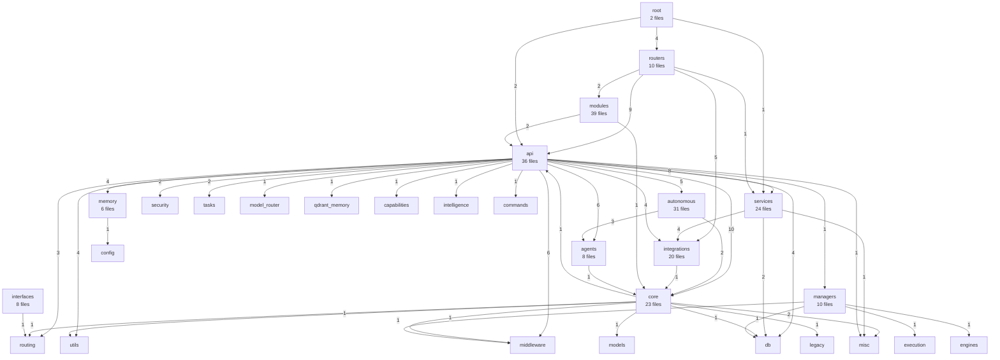

# Echo Brain Dependency Analysis

## Directory Statistics
| Directory | Files | Imported By | Total Imports |
|-----------|-------|-------------|---------------|
| agents | 8 | 3 | 10 |
| api | 36 | 4 | 14 |
| autonomous | 31 | 1 | 5 |
| core | 23 | 6 | 18 |
| integrations | 20 | 4 | 14 |
| interfaces | 8 | 1 | 1 |
| managers | 10 | 1 | 1 |
| memory | 6 | 1 | 4 |
| modules | 39 | 1 | 2 |
| root | 2 | 0 | 0 |
| routers | 10 | 1 | 4 |
| services | 24 | 4 | 11 |

## Dependency Graph

## Key Insights

### Most Imported Directories
- **core** (18 imports) from: agents, api, autonomous, integrations, modules, unused
- **api** (14 imports) from: core, modules, root, routers
- **integrations** (14 imports) from: api, routers, services, unused
- **services** (11 imports) from: api, root, routers, unused
- **db** (10 imports) from: api, core, managers, services, unused

### Consolidation Candidates (≤1 import)
- **root** (0 imports)
- **managers** (1 imports)
- **interfaces** (1 imports)

### Circular Dependencies
- api ↔ core