# Echo Brain Architecture
Generated: 2025-12-06T15:47:38.167330

## System Overview

```mermaid
graph TB
    subgraph "Echo Brain Core"
        INTEL[Intelligence Layer]
        EXEC[Execution Layer]
        OBS[Observability Layer]
    end

    subgraph "Tower Infrastructure"
        OLLAMA[Ollama LLMs]
        GPU1[AMD GPU]
        GPU2[NVIDIA GPU]
        DB[(PostgreSQL)]
        REDIS[(Redis)]
    end

    subgraph "External Services"
        GH[GitHub]
        KB[Knowledge Base]
        VAULT[HashiCorp Vault]
    end

    INTEL --> OLLAMA
    EXEC --> GPU1
    EXEC --> GPU2
    INTEL --> DB
    EXEC --> REDIS
    INTEL --> KB
    EXEC --> GH
    INTEL --> VAULT

    subgraph "Components"
        INTEL --> MR[Model Router]
        INTEL --> CC[Conversation Context]
        EXEC --> VE[Verified Executor]
        EXEC --> IA[Incremental Analyzer]
        EXEC --> SR[Safe Refactor]
        EXEC --> GO[Git Operations]
        OBS --> ET[Execution Traces]
        OBS --> PM[Performance Metrics]
    end
```

## Component Descriptions

### Intelligence Layer
- **Model Router**: Selects appropriate LLM based on task type and urgency
- **Conversation Context**: Maintains multi-turn conversation state
- **Query Handler**: Processes user queries and routes to appropriate handlers

### Execution Layer
- **Verified Executor**: Ensures actions actually succeed with verification
- **Incremental Analyzer**: Processes large codebases without timeout
- **Safe Refactor**: Git-integrated code changes with rollback capability
- **Git Operations**: Version control and GitHub integration

### Observability Layer
- **Execution Traces**: Complete audit trail of all operations
- **Performance Metrics**: Latency, success rates, resource usage
- **Alert Manager**: Proactive issue detection and notification
