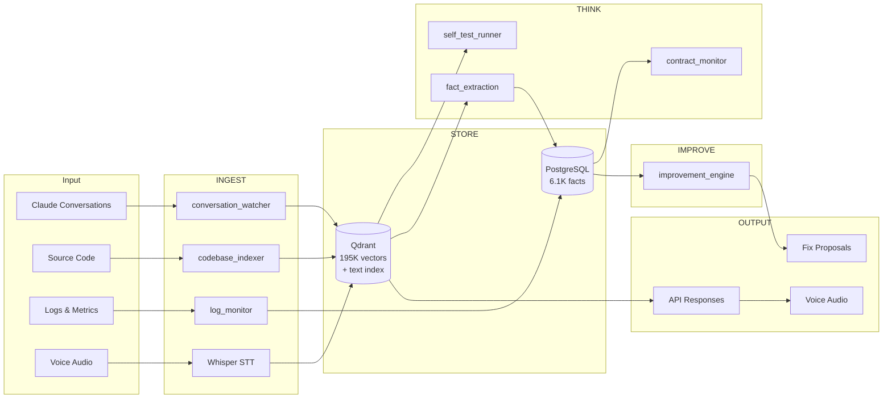
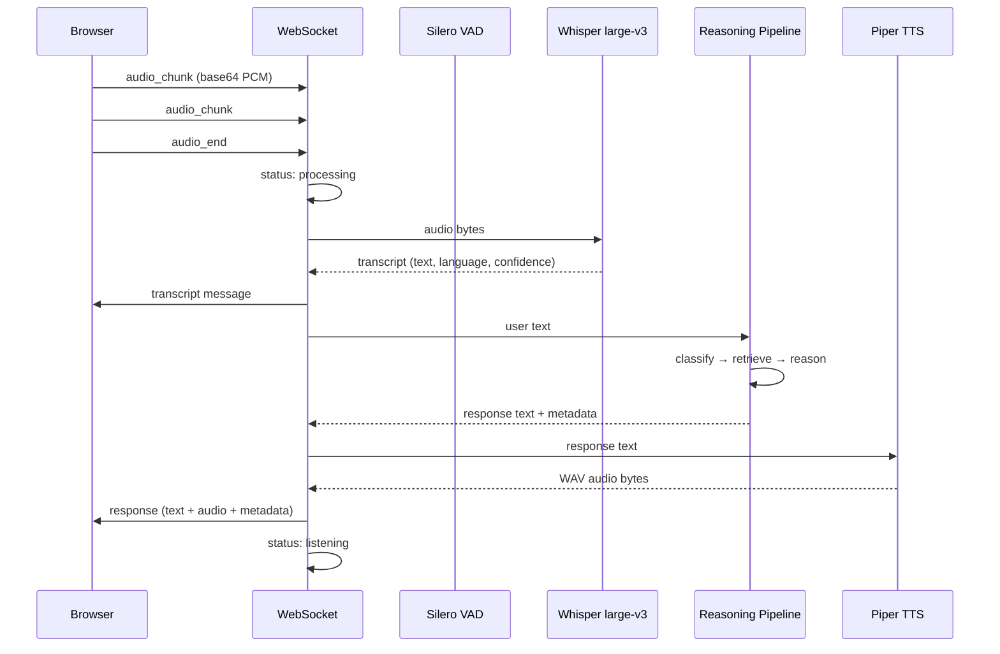

# Echo Brain Architecture Diagram

```mermaid
graph TB
    subgraph Tower["Tower Server (192.168.50.135)"]
        subgraph EB["Echo Brain (port 8309)"]
            direction TB

            subgraph API["FastAPI Application"]
                health["/health"]
                mcp["/mcp"]
                ask["/api/echo/ask"]
                memory["/api/echo/memory/*"]
                intel["/api/echo/intelligence/*"]
                knowledge["/api/echo/knowledge/*"]
                voice_api["/api/echo/voice/*"]
                reasoning["/api/echo/reasoning/*"]
                selftest["/api/echo/self-test/*"]
                diag["/api/echo/diagnostics/*"]
                auto["/api/autonomous/*"]
                workers_ep["/api/workers/status"]
            end

            subgraph Voice["Voice Service"]
                stt["Whisper large-v3<br/>(CUDA float16)"]
                tts["Piper TTS<br/>(en_US-lessac-medium)"]
                vad["Silero VAD"]
                ws["WebSocket<br/>/api/echo/voice/ws"]
            end

            subgraph Intelligence["Intelligence Layer"]
                classifier["Query Classifier<br/>(7 domains)"]
                retriever["Context Assembly<br/>(ParallelRetriever)"]
                hybrid["Hybrid Search<br/>70% vector + 30% text"]
                llm_reason["LLM Reasoning<br/>(intent-based model)"]
            end

            subgraph Workers["Worker Scheduler (12 workers)"]
                direction LR
                subgraph Ingest["INGEST"]
                    conv["conversation_watcher<br/>10 min"]
                    fw["file_watcher<br/>10 min"]
                    fact["fact_extraction<br/>30 min"]
                    domain["domain_ingestor<br/>60 min"]
                    code_idx["codebase_indexer<br/>6 hours"]
                    schema_idx["schema_indexer<br/>daily"]
                    kg["knowledge_graph<br/>daily"]
                end
                subgraph Think["THINK"]
                    contract["contract_monitor<br/>5 min"]
                    logmon["log_monitor<br/>15 min"]
                    reason_w["reasoning_worker<br/>30 min"]
                    selftest_w["self_test_runner<br/>60 min"]
                end
                subgraph Improve["IMPROVE"]
                    improve["improvement_engine<br/>2 hours"]
                end
            end
        end

        subgraph Frontend["Frontend (port 8311)"]
            voicepanel["VoicePanel"]
            systemview["SystemView"]
            askview["AskView"]
            memview["MemoryView"]
            endpoints["EndpointsView"]
        end

        subgraph Data["Data Layer"]
            pg[("PostgreSQL<br/>echo_brain<br/>6,129 facts")]
            qdrant[("Qdrant<br/>echo_memory<br/>194,921 vectors<br/>768D + text index")]
            ollama["Ollama (11434)<br/>mistral:7b<br/>nomic-embed-text<br/>gemma2:9b<br/>deepseek-r1:8b"]
        end

        subgraph GPU["GPU Compute"]
            rx["AMD RX 9070 XT 16GB<br/>(Echo Brain: Whisper, Embeddings)"]
            rtx["NVIDIA RTX 3060 12GB<br/>(ComfyUI, Ollama)"]
        end
    end

    subgraph External["External Clients"]
        browser["Browser"]
        claude["Claude Code<br/>(MCP Client)"]
    end

    %% Client connections
    browser -->|HTTP/WS| Frontend
    browser -->|WebSocket| ws
    claude -->|JSON-RPC| mcp
    Frontend -->|/api/echo/*| API

    %% Voice pipeline
    voice_api --> stt
    stt --> classifier
    voice_api --> tts
    ws --> vad
    vad --> stt

    %% Intelligence pipeline
    ask --> classifier
    classifier --> retriever
    retriever --> hybrid
    hybrid --> qdrant
    retriever --> llm_reason
    llm_reason --> ollama

    %% Worker data flows
    conv -->|embed| qdrant
    fact -->|extract via| ollama
    fact -->|store| pg
    code_idx -->|embed| qdrant
    schema_idx -->|query| pg
    kg -->|link facts| pg
    domain -->|embed| qdrant
    contract -->|test| API
    logmon -->|read| pg
    selftest_w -->|test| API
    improve -->|read issues| pg
    improve -->|reason via| ollama

    %% GPU assignments
    stt -.->|CUDA| rx
    ollama -.->|CUDA| rtx

    %% Styling
    classDef apiStyle fill:#2d5aa0,stroke:#1a3a6e,color:#fff
    classDef voiceStyle fill:#6b3fa0,stroke:#4a2d70,color:#fff
    classDef workerStyle fill:#2d7a2d,stroke:#1a5a1a,color:#fff
    classDef dataStyle fill:#a05a2d,stroke:#704020,color:#fff
    classDef gpuStyle fill:#a02d5a,stroke:#701a3a,color:#fff
    classDef frontendStyle fill:#2d8a8a,stroke:#1a6a6a,color:#fff

    class health,mcp,ask,memory,intel,knowledge,voice_api,reasoning,selftest,diag,auto,workers_ep apiStyle
    class stt,tts,vad,ws voiceStyle
    class hybrid voiceStyle
    class conv,fw,fact,domain,code_idx,schema_idx,kg,contract,logmon,reason_w,selftest_w,improve workerStyle
    class pg,qdrant,ollama dataStyle
    class rx,rtx gpuStyle
    class voicepanel,systemview,askview,memview,endpoints frontendStyle
```

## Simplified Data Flow

```mermaid
flowchart LR
    subgraph Input
        A[Claude Conversations]
        B[Source Code]
        C[Logs & Metrics]
        D[Voice Audio]
    end

    subgraph INGEST
        E[conversation_watcher]
        F[codebase_indexer]
        G[log_monitor]
        H[Whisper STT]
    end

    subgraph STORE
        I[(Qdrant<br/>195K vectors<br/>+ text index)]
        J[(PostgreSQL<br/>6.1K facts)]
    end

    subgraph THINK
        K[self_test_runner]
        L[contract_monitor]
        M[fact_extraction]
    end

    subgraph IMPROVE
        N[improvement_engine]
    end

    subgraph OUTPUT
        O[API Responses]
        P[Voice Audio]
        Q[Fix Proposals]
    end

    A --> E --> I
    B --> F --> I
    C --> G --> J
    D --> H --> I

    I --> K
    J --> L
    I --> M --> J

    J --> N --> Q

    I --> O
    O --> P
```

## Voice Pipeline

```mermaid
sequenceDiagram
    participant Client as Browser
    participant WS as WebSocket
    participant VAD as Silero VAD
    participant STT as Whisper large-v3
    participant Brain as Reasoning Pipeline
    participant TTS as Piper TTS

    Client->>WS: audio_chunk (base64 PCM)
    Client->>WS: audio_chunk
    Client->>WS: audio_end

    WS->>WS: status: processing
    WS->>STT: audio bytes
    STT-->>WS: transcript (text, language, confidence)
    WS->>Client: transcript message

    WS->>Brain: user text
    Brain->>Brain: classify → retrieve → reason
    Brain-->>WS: response text + metadata

    WS->>TTS: response text
    TTS-->>WS: WAV audio bytes
    WS->>Client: response (text + audio + metadata)
    WS->>WS: status: listening
```

## Worker Schedule

```mermaid
gantt
    title Echo Brain Worker Cycle (24 hours)
    dateFormat HH:mm
    axisFormat %H:%M

    section Every 5min
    contract_monitor    :active, cm, 00:00, 5min

    section Every 10min
    conversation_watcher :cw, 00:00, 10min
    file_watcher        :fw, 00:00, 10min

    section Every 15min
    log_monitor         :lm, 00:00, 15min

    section Every 30min
    fact_extraction     :fe, 00:00, 30min
    reasoning_worker    :rw, 00:00, 30min

    section Every 60min
    domain_ingestor     :di, 00:00, 60min
    self_test_runner    :st, 00:00, 60min

    section Every 2h
    improvement_engine  :ie, 00:00, 120min

    section Every 6h
    codebase_indexer    :ci, 00:00, 360min

    section Daily
    schema_indexer      :si, 00:00, 1440min
    knowledge_graph     :kg, 00:00, 1440min
```
