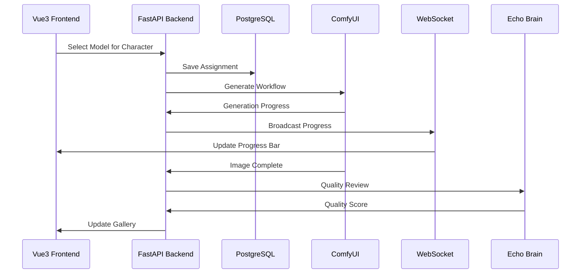

# LoRA Studio Vue3 Integration Architecture

## 1. Backend API Structure

```python
# /opt/tower-echo-brain/api/model_manager.py
from fastapi import FastAPI, WebSocket
from typing import List, Dict
import asyncio
import json

class ModelManager:
    def __init__(self):
        self.models = {
            "epicrealism_v5.safetensors": {
                "name": "epiCRealism v5",
                "type": "photorealistic",
                "sharpness": 10,
                "best_for": ["male", "female", "sharp_detail"],
                "settings": {
                    "cfg": 5.0,
                    "sampler": "dpmpp_sde",
                    "steps": 30
                }
            },
            "cyberrealistic_v9.safetensors": {
                "name": "CyberRealistic v9",
                "type": "photorealistic",
                "sharpness": 10,
                "best_for": ["male", "female", "crisp"],
                "settings": {
                    "cfg": 5.0,
                    "sampler": "dpmpp_sde",
                    "steps": 30
                }
            },
            "realistic_vision_v51.safetensors": {
                "name": "Realistic Vision 5.1",
                "type": "photorealistic",
                "sharpness": 7,
                "best_for": ["versatile", "consistent"],
                "settings": {
                    "cfg": 6.0,
                    "sampler": "dpmpp_2m",
                    "steps": 25
                }
            }
        }

    async def get_models(self) -> List[Dict]:
        return list(self.models.values())

    async def get_optimal_model(self, character_type: str) -> str:
        # Logic to select best model based on character
        if "sharp" in character_type or "detailed" in character_type:
            return "epicrealism_v5.safetensors"
        return "realistic_vision_v51.safetensors"

# WebSocket for real-time updates
@app.websocket("/ws/generation")
async def generation_updates(websocket: WebSocket):
    await websocket.accept()
    while True:
        # Send generation progress
        await websocket.send_json({
            "type": "progress",
            "character": "Yuki_Tanaka",
            "model": "epicrealism_v5",
            "progress": 45,
            "total": 100
        })
        await asyncio.sleep(1)
```

## 2. Vue3 Component Structure

```vue
<!-- /frontend/src/components/ModelSelector.vue -->
<template>
  <div class="model-selector">
    <h3>Model Configuration</h3>

    <!-- Character to Model Mapping -->
    <div v-for="character in characters" :key="character.id" class="character-model-row">
      <div class="character-info">
        
        <span>{{ character.name }}</span>
      </div>

      <select
        v-model="characterModels[character.id]"
        @change="updateModelAssignment(character.id)"
        class="model-dropdown"
      >
        <option v-for="model in availableModels" :key="model.file" :value="model.file">
          {{ model.name }} (Sharpness: {{ model.sharpness }}/10)
        </option>
      </select>

      <!-- Model Quality Indicator -->
      <div class="quality-indicator">
        <div class="sharpness-bar" :style="{width: getSharpness(character.id) + '%'}"></div>
      </div>
    </div>

    <!-- Batch Operations -->
    <div class="batch-controls">
      <button @click="applyBestModels">Auto-Assign Best Models</button>
      <button @click="startGeneration">Start LoRA Generation</button>
    </div>

    <!-- Real-time Progress -->
    <div class="generation-progress" v-if="isGenerating">
      <div v-for="progress in generationProgress" :key="progress.character">
        <span>{{ progress.character }}: </span>
        <progress :value="progress.current" :max="progress.total"></progress>
        <span>{{ progress.current }}/{{ progress.total }}</span>
      </div>
    </div>
  </div>
</template>

<script setup lang="ts">
import { ref, computed, onMounted } from 'vue'
import { useModelStore } from '@/stores/modelStore'
import { useWebSocket } from '@vueuse/core'

const modelStore = useModelStore()

const characters = ref([
  { id: 'yuki_tanaka', name: 'Yuki Tanaka', type: 'nervous_male' },
  { id: 'mei_kobayashi', name: 'Mei Kobayashi', type: 'gentle_female' },
  { id: 'rina_suzuki', name: 'Rina Suzuki', type: 'confident_female' },
  { id: 'takeshi_sato', name: 'Takeshi Sato', type: 'intimidating_male' }
])

const characterModels = ref({})
const availableModels = ref([])
const isGenerating = ref(false)
const generationProgress = ref([])

// WebSocket connection for real-time updates
const { data, send } = useWebSocket('ws://localhost:8088/ws/generation')

// Watch for WebSocket messages
watch(data, (message) => {
  const update = JSON.parse(message)
  if (update.type === 'progress') {
    updateProgress(update)
  }
})

const updateModelAssignment = async (characterId: string) => {
  const model = characterModels.value[characterId]
  await modelStore.assignModel(characterId, model)

  // Update ComfyUI workflow
  await fetch('/api/workflow/update', {
    method: 'POST',
    headers: { 'Content-Type': 'application/json' },
    body: JSON.stringify({
      character: characterId,
      model: model,
      settings: availableModels.value.find(m => m.file === model)?.settings
    })
  })
}

const applyBestModels = async () => {
  for (const character of characters.value) {
    const bestModel = await modelStore.getBestModelFor(character.type)
    characterModels.value[character.id] = bestModel
    await updateModelAssignment(character.id)
  }
}

const startGeneration = async () => {
  isGenerating.value = true

  const config = {
    characters: Object.entries(characterModels.value).map(([char, model]) => ({
      character: char,
      model: model,
      count: 100  // For LoRA training
    }))
  }

  await fetch('/api/generation/start', {
    method: 'POST',
    headers: { 'Content-Type': 'application/json' },
    body: JSON.stringify(config)
  })
}

onMounted(async () => {
  availableModels.value = await modelStore.fetchModels()
  applyBestModels()  // Auto-assign on load
})
</script>
```

## 3. Pinia Store for State Management

```typescript
// /frontend/src/stores/modelStore.ts
import { defineStore } from 'pinia'
import { ref, computed } from 'vue'

export const useModelStore = defineStore('models', () => {
  const models = ref<Map<string, ModelConfig>>(new Map())
  const characterAssignments = ref<Map<string, string>>(new Map())
  const generationQueue = ref<GenerationTask[]>([])

  const modelQualityMap = {
    'epicrealism_v5.safetensors': { sharpness: 10, speed: 7 },
    'cyberrealistic_v9.safetensors': { sharpness: 10, speed: 8 },
    'realistic_vision_v51.safetensors': { sharpness: 7, speed: 9 },
    'chilloutmix.safetensors': { sharpness: 5, speed: 8 }
  }

  async function fetchModels() {
    const response = await fetch('/api/models')
    const data = await response.json()
    data.forEach(model => models.value.set(model.file, model))
    return data
  }

  async function assignModel(characterId: string, modelFile: string) {
    characterAssignments.value.set(characterId, modelFile)

    // Notify backend of assignment
    await fetch('/api/assignments', {
      method: 'POST',
      headers: { 'Content-Type': 'application/json' },
      body: JSON.stringify({ character: characterId, model: modelFile })
    })
  }

  async function getBestModelFor(characterType: string): string {
    // Smart model selection based on character type
    if (characterType.includes('male') || characterType.includes('sharp')) {
      return 'epicrealism_v5.safetensors'
    }
    if (characterType.includes('gentle') || characterType.includes('soft')) {
      return 'realistic_vision_v51.safetensors'
    }
    return 'cyberrealistic_v9.safetensors'
  }

  const getModelQuality = computed(() => (modelFile: string) => {
    return modelQualityMap[modelFile] || { sharpness: 5, speed: 5 }
  })

  return {
    models,
    characterAssignments,
    generationQueue,
    fetchModels,
    assignModel,
    getBestModelFor,
    getModelQuality
  }
})
```

## 4. ComfyUI Workflow Generator

```python
# /opt/tower-echo-brain/workflow_generator.py
class WorkflowGenerator:
    def __init__(self):
        self.model_configs = {
            "epicrealism_v5.safetensors": {
                "cfg": 5.0,
                "sampler": "dpmpp_sde",
                "scheduler": "karras",
                "steps": 30
            },
            "cyberrealistic_v9.safetensors": {
                "cfg": 5.0,
                "sampler": "dpmpp_sde",
                "scheduler": "karras",
                "steps": 30
            },
            "realistic_vision_v51.safetensors": {
                "cfg": 6.0,
                "sampler": "dpmpp_2m",
                "scheduler": "karras",
                "steps": 25
            }
        }

    def generate_workflow(self, character: str, model: str, prompt: str) -> dict:
        config = self.model_configs.get(model, self.model_configs["realistic_vision_v51.safetensors"])

        return {
            "prompt": {
                "1": {
                    "inputs": {"ckpt_name": model},
                    "class_type": "CheckpointLoaderSimple"
                },
                "2": {
                    "inputs": {
                        "text": prompt,
                        "clip": ["1", 1]
                    },
                    "class_type": "CLIPTextEncode"
                },
                "3": {
                    "inputs": {
                        "text": "blurry, anime, cartoon, smooth skin",
                        "clip": ["1", 1]
                    },
                    "class_type": "CLIPTextEncode"
                },
                "4": {
                    "inputs": {
                        "seed": random.randint(1, 1000000000),
                        "steps": config["steps"],
                        "cfg": config["cfg"],
                        "sampler_name": config["sampler"],
                        "scheduler": config["scheduler"],
                        "denoise": 1.0,
                        "model": ["1", 0],
                        "positive": ["2", 0],
                        "negative": ["3", 0],
                        "latent_image": ["5", 0]
                    },
                    "class_type": "KSampler"
                },
                # ... rest of workflow
            }
        }
```

## 5. Database Schema for Tracking

```sql
-- PostgreSQL schema for model assignments
CREATE TABLE model_assignments (
    id SERIAL PRIMARY KEY,
    character_id VARCHAR(100) NOT NULL,
    model_file VARCHAR(255) NOT NULL,
    quality_score INTEGER,
    assigned_at TIMESTAMP DEFAULT NOW(),
    UNIQUE(character_id)
);

CREATE TABLE generation_history (
    id SERIAL PRIMARY KEY,
    character_id VARCHAR(100),
    model_file VARCHAR(255),
    image_path TEXT,
    quality_score FLOAT,
    generated_at TIMESTAMP DEFAULT NOW()
);

-- Track model performance
CREATE TABLE model_performance (
    model_file VARCHAR(255) PRIMARY KEY,
    avg_quality_score FLOAT,
    generation_count INTEGER,
    avg_generation_time FLOAT,
    last_used TIMESTAMP
);
```

## 6. Real-time Updates Flow



This architecture provides:
- Real-time model switching
- Progress tracking
- Quality scoring
- Automatic model selection
- Database persistence
- WebSocket updates