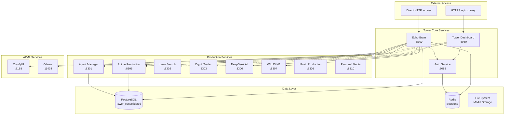
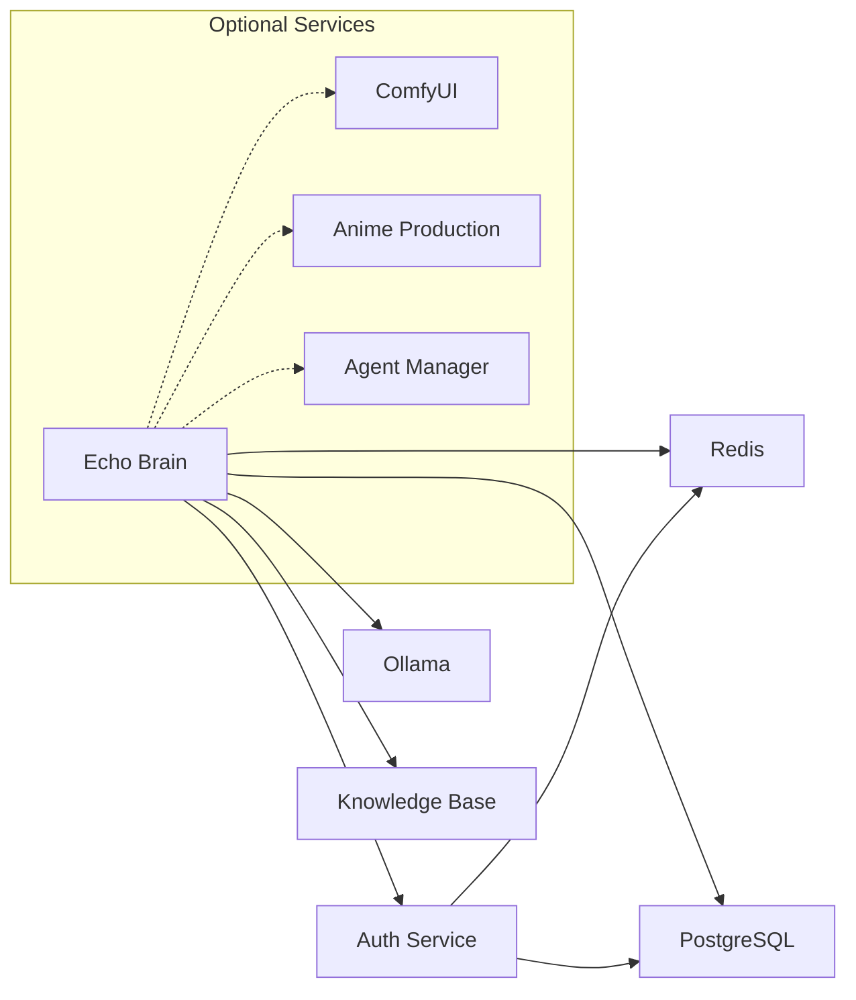
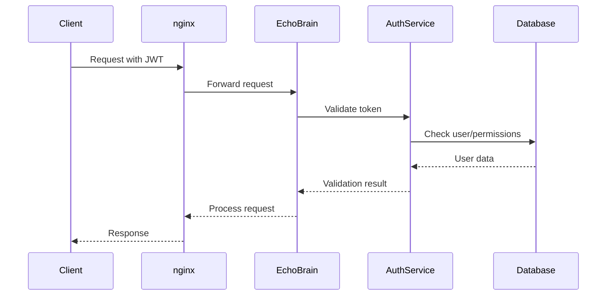

# Tower Ecosystem Integration Patterns

## Overview

The Echo Brain system serves as the central AI orchestrator within the Tower ecosystem, integrating with 10+ services through standardized patterns. This document outlines the integration architecture, data flows, communication patterns, and best practices for service interoperability.

## Table of Contents

1. [Tower Ecosystem Architecture](#tower-ecosystem-architecture)
2. [Integration Patterns](#integration-patterns)
3. [Service Dependencies](#service-dependencies)
4. [Data Flow Patterns](#data-flow-patterns)
5. [Authentication & Authorization](#authentication--authorization)
6. [Error Handling & Resilience](#error-handling--resilience)
7. [Monitoring & Observability](#monitoring--observability)
8. [Development Guidelines](#development-guidelines)

---

## Tower Ecosystem Architecture

### Core Services Overview

```
Tower Ecosystem (192.168.50.135)
├── Tower Dashboard (8080) - Main entry point and service orchestration
├── Echo Brain (8309) - AI orchestrator and intelligence hub
├── Anime Production (8305) - Creative production pipeline
├── Agent Manager (8301) - AI agent lifecycle management
├── Loan Search (8302) - Financial services integration
├── CryptoTrader (8303) - Trading and analysis platform
├── ComfyUI (8188) - AI image/video generation
├── DeepSeek AI (8306) - Specialized AI reasoning
├── WikiJS KB (8307) - Knowledge base and documentation
├── Music Production (8308) - Audio creation and management
├── Personal Media (8310) - Media integration platform
└── Auth Service (8088) - Centralized authentication
```

### Network Architecture



---

## Integration Patterns

### 1. Hub-and-Spoke Pattern (Echo Brain Central)

**Description**: Echo Brain acts as the central intelligence hub, coordinating requests across Tower services.

**Implementation**:
```python
# Echo Brain Universal Testing Framework
class TowerTestingFramework:
    def __init__(self):
        self.services = {
            "dashboard": "http://192.168.50.135:8080",
            "anime": "http://192.168.50.135:8305",
            "agent-manager": "http://192.168.50.135:8301",
            "loan-search": "http://192.168.50.135:8302",
            "crypto-trader": "http://192.168.50.135:8303",
            "comfyui": "http://192.168.50.135:8188"
        }

    async def test_service(self, service_name: str):
        """Universal service testing via Echo Brain"""
        url = self.services.get(service_name)
        return await self._comprehensive_test(url)
```

**Use Cases**:
- Service health monitoring from single point
- AI-powered debugging across services
- Centralized logging and analytics
- Cross-service workflow orchestration

**Benefits**:
- Simplified service discovery
- Centralized intelligence and decision making
- Consistent monitoring and testing
- Reduced service-to-service coupling

### 2. Event-Driven Integration

**Description**: Services communicate through events and WebSocket streams for real-time updates.

**Implementation**:
```python
# Echo Brain WebSocket Broadcasting
class ConnectionManager:
    async def broadcast_service_event(self, event_type: str, service: str, data: dict):
        """Broadcast service events to all connected clients"""
        message = {
            "type": event_type,
            "service": service,
            "data": data,
            "timestamp": datetime.utcnow().isoformat()
        }
        await self.broadcast_json(message)

# Example: Anime Production Service Integration
async def notify_echo_brain(project_status: str, project_id: str):
    """Notify Echo Brain of project status changes"""
    async with aiohttp.ClientSession() as session:
        await session.post(
            "http://192.168.50.135:8309/api/echo/events/anime",
            json={
                "event": "project_status_change",
                "project_id": project_id,
                "status": project_status
            }
        )
```

**Use Cases**:
- Real-time status updates across services
- Workflow state synchronization
- Live monitoring dashboards
- Event-driven automation

### 3. API Gateway Pattern (nginx Proxy)

**Description**: All external access routes through nginx reverse proxy with HTTPS termination.

**Configuration**:
```nginx
# /etc/nginx/sites-available/tower.conf
upstream echo_brain {
    server 127.0.0.1:8309;
}

upstream anime_production {
    server 127.0.0.1:8305;
}

server {
    listen 443 ssl;
    server_name 192.168.50.135;

    location /api/echo/ {
        proxy_pass http://echo_brain/api/echo/;
        proxy_set_header Host $host;
        proxy_set_header X-Real-IP $remote_addr;
        proxy_set_header X-Forwarded-For $proxy_add_x_forwarded_for;
        proxy_set_header X-Forwarded-Proto $scheme;
    }

    location /api/anime/ {
        proxy_pass http://anime_production/api/anime/;
        # WebSocket support
        proxy_http_version 1.1;
        proxy_set_header Upgrade $http_upgrade;
        proxy_set_header Connection "upgrade";
    }
}
```

**Benefits**:
- Centralized SSL termination
- Load balancing capabilities
- Request routing and filtering
- Consistent external interface

### 4. Database Integration Pattern

**Description**: Shared PostgreSQL database with service-specific schemas and cross-service data access.

**Schema Organization**:
```sql
-- Tower Consolidated Database Structure
tower_consolidated/
├── echo_* tables          -- Echo Brain core data
├── board_* tables         -- Board of Directors governance
├── anime_* tables         -- Anime Production workflows
├── agent_* tables         -- Agent Manager data
├── conversation_* tables  -- Cross-service conversations
├── auth_* tables         -- Authentication and sessions
└── shared_* tables       -- Cross-service reference data
```

**Integration Example**:
```python
# Echo Brain database integration
class EchoBrainDatabase:
    def __init__(self):
        self.config = {
            "host": "192.168.50.135",
            "database": "tower_consolidated",
            "user": "patrick"
        }

    async def log_service_interaction(self, service: str, action: str, data: dict):
        """Log cross-service interactions for analytics"""
        query = """
        INSERT INTO echo_service_interactions
        (service_name, action_type, interaction_data, timestamp)
        VALUES ($1, $2, $3, $4)
        """
        await self.execute(query, service, action, json.dumps(data), datetime.utcnow())

    async def get_service_analytics(self, service: str, days: int = 7):
        """Get service usage analytics for Echo Brain insights"""
        query = """
        SELECT action_type, COUNT(*), AVG(processing_time)
        FROM echo_service_interactions
        WHERE service_name = $1 AND timestamp > NOW() - INTERVAL '%s days'
        GROUP BY action_type
        """
        return await self.fetch_all(query, service, days)
```

### 5. Authentication Delegation Pattern

**Description**: Centralized authentication through Tower Auth Service with JWT token validation.

**Implementation**:
```python
# Echo Brain Auth Middleware
from directors.auth_middleware import get_current_user, require_permission

@app.post("/api/echo/board/task")
async def submit_board_task(
    request: TaskSubmissionRequest,
    current_user = Depends(get_current_user),
    _permission = Depends(require_permission("board.submit_task"))
):
    """Submit task with authentication and authorization"""
    # Process authenticated request
    pass

# Cross-service auth validation
async def validate_service_request(service_name: str, token: str):
    """Validate service-to-service requests"""
    async with aiohttp.ClientSession() as session:
        response = await session.post(
            "http://192.168.50.135:8088/api/auth/validate",
            headers={"Authorization": f"Bearer {token}"},
            json={"service": service_name}
        )
        return response.status == 200
```

**Features**:
- JWT token validation across all services
- Role-based access control (RBAC)
- Service-to-service authentication
- Session management through Redis

---

## Service Dependencies

### Echo Brain Dependencies



### Critical Path Analysis

**Tier 1 (Core Dependencies)**:
- PostgreSQL Database (required for data persistence)
- Ollama (required for AI model operations)
- Auth Service (required for protected endpoints)

**Tier 2 (Enhanced Features)**:
- Redis (required for session management and caching)
- Knowledge Base (required for documentation integration)

**Tier 3 (Optional Integrations)**:
- ComfyUI (AI image generation)
- Anime Production (workflow integration)
- Agent Manager (AI agent coordination)

### Graceful Degradation

```python
class ServiceHealthManager:
    async def check_dependencies(self):
        """Check all service dependencies and enable graceful degradation"""
        health_status = {}

        # Tier 1 - Critical services
        health_status['postgres'] = await self._check_postgres()
        health_status['ollama'] = await self._check_ollama()
        health_status['auth'] = await self._check_auth_service()

        # Tier 2 - Enhanced features
        health_status['redis'] = await self._check_redis()
        health_status['kb'] = await self._check_knowledge_base()

        # Tier 3 - Optional integrations
        health_status['comfyui'] = await self._check_comfyui()

        return self._determine_service_mode(health_status)

    def _determine_service_mode(self, health_status):
        """Determine Echo Brain operational mode based on dependencies"""
        if not all([health_status['postgres'], health_status['ollama']]):
            return "degraded"  # Core functionality impacted
        elif not health_status['auth']:
            return "limited"   # No protected endpoints
        else:
            return "full"      # All systems operational
```

---

## Data Flow Patterns

### 1. Request-Response Pattern

**Standard API Communication**:
```
Client Request → nginx → Service → Database → Response
```

**Example: Echo Brain Query Processing**:
```python
@app.post("/api/echo/query")
async def process_query(request: QueryRequest):
    # 1. Validate request
    # 2. Select appropriate model based on complexity
    # 3. Process with Ollama
    # 4. Store interaction in PostgreSQL
    # 5. Return structured response
    pass
```

### 2. Stream Processing Pattern

**WebSocket Real-time Data**:
```
Service Event → Echo Brain → WebSocket Broadcast → Connected Clients
```

**Implementation**:
```python
async def stream_brain_activity():
    """Stream real-time brain activity to connected clients"""
    while True:
        brain_state = await get_current_brain_state()
        await connection_manager.broadcast_json({
            "type": "brain_activity",
            "timestamp": datetime.utcnow().isoformat(),
            "brain_state": brain_state
        })
        await asyncio.sleep(1)  # 1Hz update rate
```

### 3. Background Processing Pattern

**Asynchronous Task Processing**:
```
Request → Task Queue → Background Worker → Status Updates → Completion
```

**Example: Model Management**:
```python
@app.post("/api/echo/models/manage")
async def manage_model(request: ModelManagementRequest, background_tasks: BackgroundTasks):
    # 1. Validate request and check permissions
    # 2. Submit to background queue
    # 3. Return immediate response with tracking ID
    # 4. Background worker processes actual model operation
    # 5. WebSocket updates provide progress information

    request_id = str(uuid.uuid4())
    background_tasks.add_task(process_model_operation, request, request_id)

    return ModelManagementResponse(
        request_id=request_id,
        status="accepted",
        message="Model operation queued for processing"
    )
```

### 4. Event Aggregation Pattern

**Cross-service Event Collection**:
```python
class EventAggregator:
    """Collect and analyze events from all Tower services"""

    async def collect_service_events(self):
        """Aggregate events from multiple services for analysis"""
        events = []

        # Collect from multiple sources
        anime_events = await self._get_anime_events()
        agent_events = await self._get_agent_events()
        system_events = await self._get_system_events()

        # Correlate and analyze
        correlated_events = self._correlate_events(
            anime_events + agent_events + system_events
        )

        # Store for AI analysis
        await self._store_event_patterns(correlated_events)

        return correlated_events
```

---

## Authentication & Authorization

### JWT Token Flow



### Permission Model

```python
# Role-based permissions for Echo Brain operations
PERMISSIONS = {
    "board.submit_task": ["board_user", "board_contributor", "admin"],
    "board.view_decisions": ["board_user", "board_viewer", "board_contributor", "admin"],
    "board.provide_feedback": ["board_contributor", "board_reviewer", "admin"],
    "board.override_decisions": ["board_admin", "system_admin"],
    "model.manage": ["model_admin", "system_admin"],
    "model.remove_large": ["system_admin"],  # 70B+ models
    "testing.run_comprehensive": ["tester", "admin"],
    "system.debug": ["system_admin", "devops"]
}

# Service-to-service authentication
SERVICE_KEYS = {
    "anime-production": "service_key_anime_prod",
    "agent-manager": "service_key_agent_mgr",
    "tower-dashboard": "service_key_dashboard"
}
```

### Security Headers

```python
# Standard security headers for all Tower services
SECURITY_HEADERS = {
    "X-Content-Type-Options": "nosniff",
    "X-Frame-Options": "DENY",
    "X-XSS-Protection": "1; mode=block",
    "Strict-Transport-Security": "max-age=31536000; includeSubDomains",
    "Content-Security-Policy": "default-src 'self'; ws-src 'self'",
    "X-Service-Name": "echo-brain",
    "X-Service-Version": "1.0.0"
}
```

---

## Error Handling & Resilience

### Circuit Breaker Pattern

```python
class ServiceCircuitBreaker:
    """Circuit breaker for service-to-service communication"""

    def __init__(self, service_name: str, failure_threshold: int = 5):
        self.service_name = service_name
        self.failure_threshold = failure_threshold
        self.failure_count = 0
        self.state = "closed"  # closed, open, half-open
        self.last_failure_time = None

    async def call_service(self, url: str, **kwargs):
        """Call service with circuit breaker protection"""
        if self.state == "open":
            if self._should_attempt_reset():
                self.state = "half-open"
            else:
                raise ServiceUnavailableError(f"{self.service_name} circuit breaker open")

        try:
            response = await self._make_request(url, **kwargs)
            if self.state == "half-open":
                self._reset_circuit()
            return response
        except Exception as e:
            self._record_failure()
            raise

    def _record_failure(self):
        """Record service failure and update circuit state"""
        self.failure_count += 1
        self.last_failure_time = datetime.utcnow()

        if self.failure_count >= self.failure_threshold:
            self.state = "open"
            logger.warning(f"Circuit breaker opened for {self.service_name}")
```

### Retry Strategy

```python
async def resilient_service_call(service_url: str, max_retries: int = 3):
    """Make resilient service calls with exponential backoff"""
    for attempt in range(max_retries):
        try:
            timeout = aiohttp.ClientTimeout(total=30)  # 30 second timeout
            async with aiohttp.ClientSession(timeout=timeout) as session:
                async with session.get(service_url) as response:
                    if response.status == 200:
                        return await response.json()
                    elif response.status in [502, 503, 504]:
                        # Temporary failures - retry
                        if attempt < max_retries - 1:
                            await asyncio.sleep(2 ** attempt)  # Exponential backoff
                            continue
                    else:
                        # Permanent failures - don't retry
                        raise HTTPException(response.status, await response.text())
        except asyncio.TimeoutError:
            if attempt < max_retries - 1:
                await asyncio.sleep(2 ** attempt)
                continue
            raise ServiceTimeoutError(f"Service {service_url} timed out after {max_retries} attempts")

    raise ServiceUnavailableError(f"Service {service_url} failed after {max_retries} attempts")
```

### Fallback Mechanisms

```python
async def get_ai_response_with_fallback(query: str, context: dict = None):
    """Get AI response with multiple fallback strategies"""

    # Primary: Echo Brain with full context
    try:
        return await call_echo_brain(query, context)
    except ServiceUnavailableError:
        logger.warning("Echo Brain unavailable, trying DeepSeek fallback")

    # Fallback 1: DeepSeek AI service
    try:
        return await call_deepseek_service(query)
    except ServiceUnavailableError:
        logger.warning("DeepSeek unavailable, trying direct Ollama")

    # Fallback 2: Direct Ollama call
    try:
        return await call_ollama_direct(query)
    except ServiceUnavailableError:
        logger.error("All AI services unavailable")

    # Final fallback: Static response
    return {
        "response": "AI services are currently unavailable. Please try again later.",
        "model_used": "fallback",
        "service_status": "degraded"
    }
```

---

## Monitoring & Observability

### Health Check Endpoints

```python
# Standardized health check across all Tower services
@app.get("/api/health")
async def health_check():
    """Comprehensive health check for service dependencies"""
    health_status = {
        "service": "echo-brain",
        "status": "healthy",
        "timestamp": datetime.utcnow().isoformat(),
        "version": "1.0.0",
        "dependencies": {}
    }

    # Check each dependency
    dependencies = [
        ("postgres", check_postgres_health),
        ("ollama", check_ollama_health),
        ("auth", check_auth_service_health),
        ("redis", check_redis_health)
    ]

    overall_healthy = True
    for dep_name, check_func in dependencies:
        try:
            dep_status = await check_func()
            health_status["dependencies"][dep_name] = dep_status
            if dep_status["status"] != "healthy":
                overall_healthy = False
        except Exception as e:
            health_status["dependencies"][dep_name] = {
                "status": "unhealthy",
                "error": str(e)
            }
            overall_healthy = False

    if not overall_healthy:
        health_status["status"] = "degraded"

    return health_status
```

### Metrics Collection

```python
class ServiceMetrics:
    """Collect and expose service metrics for monitoring"""

    def __init__(self):
        self.request_count = 0
        self.error_count = 0
        self.response_times = []
        self.active_connections = 0

    def record_request(self, endpoint: str, duration: float, status_code: int):
        """Record request metrics"""
        self.request_count += 1
        self.response_times.append(duration)

        if status_code >= 400:
            self.error_count += 1

        # Keep only last 1000 response times for rolling averages
        if len(self.response_times) > 1000:
            self.response_times = self.response_times[-1000:]

    def get_metrics(self):
        """Get current service metrics"""
        return {
            "requests_total": self.request_count,
            "errors_total": self.error_count,
            "error_rate": self.error_count / max(self.request_count, 1),
            "avg_response_time": sum(self.response_times) / max(len(self.response_times), 1),
            "active_connections": self.active_connections,
            "uptime_seconds": (datetime.utcnow() - startup_time).total_seconds()
        }

# Metrics endpoint
@app.get("/api/metrics")
async def get_service_metrics():
    """Expose service metrics for monitoring systems"""
    return service_metrics.get_metrics()
```

### Distributed Tracing

```python
import uuid
from contextvars import ContextVar

# Request correlation ID for distributed tracing
correlation_id: ContextVar[str] = ContextVar('correlation_id')

@app.middleware("http")
async def add_correlation_id(request: Request, call_next):
    """Add correlation ID to all requests for distributed tracing"""
    trace_id = request.headers.get("X-Correlation-ID", str(uuid.uuid4()))
    correlation_id.set(trace_id)

    response = await call_next(request)
    response.headers["X-Correlation-ID"] = trace_id
    return response

async def call_service_with_tracing(service_url: str, **kwargs):
    """Make service calls with distributed tracing headers"""
    headers = kwargs.get("headers", {})
    headers["X-Correlation-ID"] = correlation_id.get()
    headers["X-Source-Service"] = "echo-brain"

    kwargs["headers"] = headers
    return await make_service_call(service_url, **kwargs)
```

---

## Development Guidelines

### Service Integration Checklist

**When integrating with Echo Brain:**

✅ **Authentication**
- [ ] Implement JWT token validation
- [ ] Define required permissions for endpoints
- [ ] Handle authentication errors gracefully

✅ **Health Checks**
- [ ] Implement standardized `/api/health` endpoint
- [ ] Check all service dependencies
- [ ] Return consistent health status format

✅ **Error Handling**
- [ ] Use standardized error response format
- [ ] Implement appropriate HTTP status codes
- [ ] Provide correlation IDs for debugging

✅ **Documentation**
- [ ] OpenAPI/Swagger specification
- [ ] Integration examples
- [ ] Error scenarios and responses

✅ **Monitoring**
- [ ] Expose metrics endpoint
- [ ] Implement distributed tracing
- [ ] Log significant events with correlation IDs

### API Design Standards

```python
# Standard response format for all Tower services
class StandardResponse(BaseModel):
    success: bool
    data: Optional[Any] = None
    message: Optional[str] = None
    request_id: str
    timestamp: datetime
    service: str

# Error response format
class ErrorResponse(BaseModel):
    detail: str
    request_id: str
    type: str
    timestamp: datetime
    service: str
    correlation_id: Optional[str] = None

# Health check response format
class HealthResponse(BaseModel):
    service: str
    status: Literal["healthy", "degraded", "unhealthy"]
    timestamp: datetime
    version: str
    dependencies: Dict[str, Dict[str, Any]]
```

### Testing Integration

```python
# Integration test template for Tower services
class TestTowerIntegration:
    """Template for testing Echo Brain service integration"""

    async def test_service_discovery(self):
        """Test that Echo Brain can discover and test the service"""
        response = await client.post("/api/echo/test/your-service")
        assert response.status_code == 200
        assert response.json()["success"] == True

    async def test_health_check_integration(self):
        """Test health check responds correctly"""
        response = await client.get("/api/health")
        assert response.status_code == 200
        assert "dependencies" in response.json()

    async def test_authentication_integration(self):
        """Test JWT authentication works with Tower auth service"""
        # Test without token
        response = await client.post("/api/protected-endpoint")
        assert response.status_code == 401

        # Test with valid token
        token = await get_test_jwt_token()
        response = await client.post(
            "/api/protected-endpoint",
            headers={"Authorization": f"Bearer {token}"}
        )
        assert response.status_code == 200

    async def test_error_handling(self):
        """Test standardized error responses"""
        response = await client.get("/api/nonexistent")
        assert response.status_code == 404
        error_data = response.json()
        assert "request_id" in error_data
        assert "timestamp" in error_data
```

### Performance Guidelines

**Response Time Targets**:
- Health checks: < 100ms
- Simple queries: < 1s
- Complex AI operations: < 30s
- Background operations: Immediate response + status tracking

**Resource Limits**:
- Memory usage: < 2GB per service
- CPU usage: < 50% sustained
- Database connections: < 20 per service
- WebSocket connections: < 100 concurrent

**Scaling Considerations**:
- Design for horizontal scaling
- Use connection pooling for databases
- Implement rate limiting for expensive operations
- Cache frequently accessed data

---

## Summary

The Tower ecosystem integration patterns provide a robust foundation for service interoperability with Echo Brain as the central intelligence hub. Key principles include:

1. **Standardized Communication**: Consistent API patterns, authentication, and error handling
2. **Resilient Design**: Circuit breakers, retries, and graceful degradation
3. **Observable Systems**: Comprehensive monitoring, health checks, and distributed tracing
4. **Secure Integration**: JWT authentication, RBAC, and service-to-service security
5. **Performance Focus**: Optimized response times and resource utilization

These patterns ensure that services can integrate seamlessly while maintaining independence, reliability, and observability across the entire Tower ecosystem.